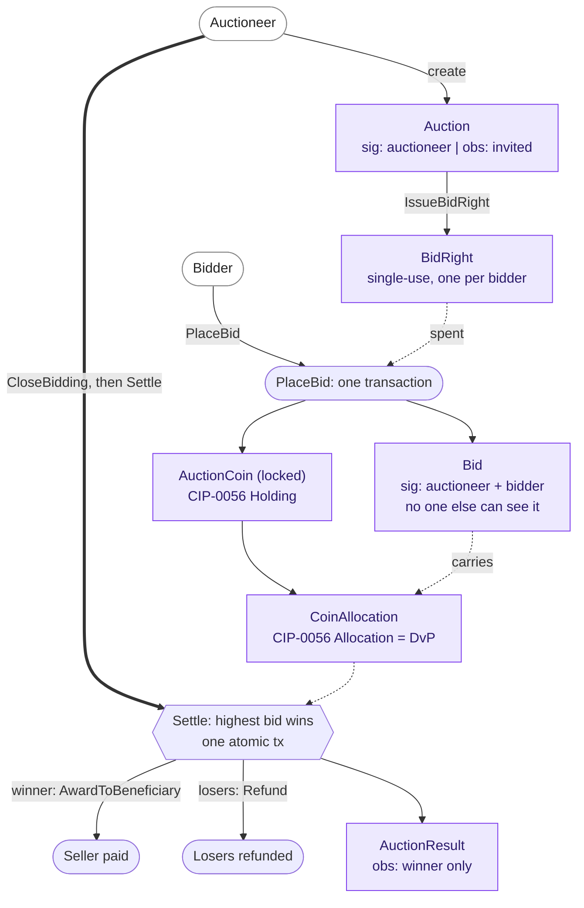

# From Solidity to Daml: A Confidential Auction on Canton

> A guide for Ethereum developers. We build the *same* sealed-bid auction twice,
> once in Solidity for the EVM, once in Daml for Canton, and watch what happens
> to the code when the ledger itself can keep a secret.

If you write Solidity, you already know how to think about auctions, escrow, and
settlement. What you have *not* had to think about is privacy, because the EVM
doesn't offer any: every storage slot and every byte of calldata is world-readable
the moment it's mined. Canton flips that default. This guide ports one contract
across the gap so you can map what you know onto what's new.

We pick a **sealed-bid auction** on purpose, because confidentiality is its entire
reason to exist. It's the example where the EVM's transparency hurts most and where
Canton's model pays off most clearly.

---

## 1. The punchline first

Here is the same auction, both ways, measured by what the code spends its effort on:

| | Solidity (`solidity/`) | Daml (`daml/`) |
|---|---|---|
| Keeps bids secret using | commit/reveal + `keccak256` hashes | the ledger's privacy model |
| Secrecy lasts | until the reveal phase (then public forever) | permanently (losers never see winning bid) |
| Keeps a bid binding via | a forfeitable deposit | funds locked at bid, refunded atomically if you lose |
| Needs an explicit timeline (commit window, reveal window) | yes | a single `settleBy` deadline |
| Settling the winner + refunding losers | reveal → `withdraw()` pulls → `auctionEnd()`, across transactions | one atomic delivery-versus-payment |
| Who can read a bid | everyone, after reveal | only the auctioneer and that bidder, ever |

The commit/reveal **privacy scaffolding** (hashing, the reveal phase, forfeiture)
has no counterpart in Daml: the thing it simulates (a bid only some parties can see)
is a primitive of the platform. The two contracts still end up a similar length, and
that is the lesson. Daml has no native currency, so it spends those lines on a token
and one *atomic* delivery-versus-payment, not on faking privacy and chasing
pull-payment refunds across transactions.

### The whole auction, at a glance

Six templates, who signs what, and the bid-to-settle flow in one picture. The
sections below walk through each piece; keep this map handy.



---

## 2. The mental model shift

This is the part to internalize. Everything else is mechanical.

**Solidity: one global computer, shared state, public by default.**
A contract is an object living at an address. Its storage is a single shared
database that the whole world can read. `msg.sender` tells you who called. To
hide anything, you must encrypt or hash it yourself and reveal later.

**Daml: a network of parties, per-party state, private by default.**
A contract is an immutable record on a *distributed* ledger. Each contract names
its **signatories** (who must authorize and who are bound by it) and its
**observers** (who may additionally see it). A party's "ledger" is exactly the
set of contracts where they are a signatory or observer, and *nothing else*.
There is no global readable state to leak.

So the central question changes:

- In Solidity you ask: *"who is allowed to call this function?"* (and you guard it with `require`).
- In Daml you ask: *"who needs to see this, and whose authority does it carry?"* (and you answer with `signatory` / `observer` / `controller`).

---

## 3. The concept map

Keep this table next to you while reading both contracts.

| Solidity / EVM | Daml / Canton | Notes |
|---|---|---|
| Contract at an address | `template` + a contract instance (a `ContractId`) | A template is the code; each created contract is an immutable instance. |
| Mutable storage variables | Immutable contracts; "update" = archive old + create new | There is no in-place mutation. `CloseBidding` *recreates* the Auction with `biddingOpen = False`. |
| `mapping(address => Bid) bids` | Many separate `Bid` contracts, one per bidder | No shared map; each bid is its own confidential contract. |
| `msg.sender` | `controller` of a choice | The party exercising a choice is authenticated by the ledger, not read from a transaction field. |
| `require(msg.sender == owner)` | `controller auctioneer` on the choice | Authorization is declared, not checked imperatively. |
| `require(cond, "msg")` | `assertMsg "msg" cond` | Same idea for *business-rule* checks (e.g. "bid must be positive"). |
| `function` (mutating) | consuming `choice` | Archives the contract it's exercised on, optionally creating successors. |
| `view`/`pure function` | `nonconsuming choice` or off-ledger `query` | `PlaceBid` is nonconsuming so the Auction survives repeated bids. |
| `modifier onlyOwner` | choice `controller` + `signatory` | Who can act is part of the choice's type, enforced by the engine. |
| `event Foo(...)` / `emit` | the transaction record itself + `observer`s | Stakeholders see the transaction; there's no separate event log to subscribe to for state. |
| `block.timestamp` deadlines | application-layer timing / `getTime` in scripts | Canton has time, but our Daml model gates with an explicit `biddingOpen` flag the auctioneer flips. |
| `address(this).balance`, `msg.value`, `call{value:}` | the Canton Network Token Standard's `Holding` + `Allocation` interfaces | Daml has no native "ether." Value is held as a token-standard `Holding`; transfer is an atomic `Allocation` (DvP). The sample ships a minimal registry that *implements* those interfaces; production swaps in Canton Coin. |
| Reentrancy guards, pull-payment | none | No external calls mid-execution; the class of bug largely doesn't arise. |
| `keccak256(abi.encodePacked(...))` commit | none | Deleted. Privacy is native, so there is nothing to commit to. |

---

## 4. Authorization: `require` vs. `signatory`/`controller`

In Solidity, authorization is an imperative check you remember to write:

```solidity
function commit(bytes32 blindedBid) external payable onlyBefore(biddingEnd) {
    if (bids[msg.sender].blindedBid != bytes32(0)) revert AlreadyCommitted();
    // ...anyone who passes the guards may call
}
```

In Daml, authorization is *part of the type of the choice*. You cannot exercise
`PlaceBid` as anyone other than the named controller, and the resulting `Bid`
cannot exist unless both its signatories authorized it:

```daml
nonconsuming choice PlaceBid : ContractId Bid
  with bidder : Party; amount : Decimal
  controller bidder                       -- only `bidder` can do this
  do
    assertMsg "bidder must be invited" (bidder `elem` invited)
    create Bid with auctioneer, auctionId, bidder, item, amount   -- signed by [auctioneer, bidder]
```

> Simplified to the authorization essentials. The real `PlaceBid` also takes the
> bidder's `funds` and a single-use `BidRight`, and signs a `Bid` with a few more
> fields (see [`ConfidentialAuction.daml`](../daml/daml/ConfidentialAuction.daml) for
> the full shape). What matters here is the controller/signatory relationship.

The subtle, powerful part: the choice body runs with the **authority of the
Auction's signatory (the auctioneer) plus the controller (the bidder)**, exactly
the two signatures the `Bid` needs. This *delegated authority* is how a single
bidder transaction can create a contract co-signed by the auctioneer, without the
auctioneer being online. There is no Solidity equivalent; it's the Daml feature
that replaces a lot of approval/allowance boilerplate.

---

## 5. Where the privacy actually comes from

This is the one screenful to remember. In Daml:

```daml
template Bid
  with
    auctioneer : Party
    bidder : Party
    item : Text
    amount : Decimal
  where
    signatory auctioneer, bidder    -- and NOBODY else is named here
```

> Trimmed to the fields that carry the privacy story. The real `Bid` also holds
> `auctionId`, `beneficiary`, and the token-standard `allocation`; the `signatory`
> line, which is the whole point here, is verbatim.

Because only `auctioneer` and `bidder` are stakeholders, **no other party's
ledger ever contains this contract.** A competing bidder cannot `fetch` it, cannot
`query` it, cannot learn it exists. Our test asserts exactly this against a running
ledger:

```daml
aliceView <- query @Bid alice
case aliceView of
  [(_, bid)] -> bid.bidder === alice   -- Alice sees exactly one bid, and it's hers
  _ -> abort "Alice should see only her own bid"
auctioneerView <- query @Bid auctioneer
length auctioneerView === 3            -- the auctioneer, a signatory on all, sees every bid
```

Contrast the Solidity contract, which can only *delay* disclosure: bids are hashes
until the reveal phase, then permanently public. On Canton the losing bids are
*never* disclosed: `AuctionResult` is observed only by the winner, so losers don't
even learn the clearing price. That's not extra work; it's the absence of work.

---

## 6. Where the logic lives: on-chain loops vs. off-ledger orchestration

A reflex to unlearn: in Solidity you often loop over all participants on-chain.
In Daml a choice can only see contracts explicitly handed to it, because privacy
means there's no global set to iterate. So winner selection works in two moves:

1. **Off-ledger**, the auctioneer (the only party who can see every `Bid`) gathers
   the contract ids, in production by querying the Active Contract Set with PQS
   (Daml 3 has no *unique-key* lookups); in our test via `query @Bid`.
2. **On-ledger**, it passes them to `Settle`, which fetches each, validates it
   belongs to the auction, picks the max, and settles the funds atomically:

```daml
choice Settle : ContractId AuctionResult
  with bidCids : [ContractId Bid]
  controller auctioneer
  do
    assertMsg "close bidding before settling" (not biddingOpen)
    now <- getTime
    assertMsg "the settlement window has passed" (now <= settleBy)
    -- de-duplicate the caller's list so a repeated id can't double-spend a bid
    let uniqueCids = foldl (\seen c -> if c `elem` seen then seen else seen <> [c]) [] bidCids
    bids <- forA uniqueCids \cid -> do
      bid <- fetch cid
      assertMsg "bid does not belong to this auction"
        (bid.auctioneer == auctioneer && bid.auctionId == auctionId && bid.item == item)
      pure (cid, bid)
    case sortOn (\(_, bid) -> negate bid.amount) bids of
      [] -> abort "cannot settle an auction with no bids"
      ((winCid, winBid) :: losers) -> do
        -- DvP: execute the winner's allocation, refund the losers, atomically.
        exercise winCid AwardToBeneficiary           -- winner's locked funds -> seller
        _ <- forA losers \(cid, _) -> exercise cid Refund  -- losers refunded, same tx
        create AuctionResult with
          auctioneer; item; winner = winBid.bidder; winningAmount = winBid.amount
```

Each `Bid` carries the bidder's locked funds as a token-standard `Allocation` (the
CIP-0056 atomic-DvP primitive). `AwardToBeneficiary` *executes* the winner's
allocation (the standard `Allocation_ExecuteTransfer` choice moves the funds) and
forwards the proceeds to the beneficiary; `Refund` *cancels* each loser's allocation
(`Allocation_Cancel`), returning their locked funds. Both archive the `Bid` they run
on, and it all happens in this one transaction: either the winner pays and every
loser is refunded, or nothing moves. That atomicity *is* delivery-versus-payment, and
it replaces Solidity's escrow-then-`withdraw` pull-payment dance. The auctioneer can
drive a co-signed bid's allocation *alone* because the bidder, by signing the `Bid`,
pre-authorized exactly the allocation choices the standard requires.

---

## 7. Things that simply vanished

If you came from the Solidity file, here's what you'll notice is *gone*, and why:

- **The commit hash (`keccak256`)**: nothing to hide-then-reveal; the bid is born private.
- **The reveal phase**: privacy is native, so there's no hide-then-reveal window
  (settlement still has a single `settleBy` deadline).
- **Forfeiture**: losing bidders aren't punished; their locked funds are returned
  atomically *when the auctioneer settles*, so there's no "reveal or lose your
  deposit" threat (its flip side, an auctioneer who never settles, is the liveness
  caveat in section 8).
- **`pendingReturns` / `withdraw()` pull-payments**: settlement pays the winner's
  funds to the seller and refunds every loser in one atomic transaction, so there's
  no escrow-then-withdraw step and no reentrancy surface.
- **The `ended` flag and the multi-step finalizer**: settlement is a single atomic
  choice, not a "reveal, then withdraw, then poke `auctionEnd`" sequence.

What's left is the auction plus the two things Daml makes you state explicitly: a
token (there is no native currency) and an atomic delivery-versus-payment.

---

## 8. A word on what *doesn't* port cleanly

Honesty matters more than a clean story:

- **Value / the token.** Daml has no native currency, so value is held as the real
  Canton Network Token Standard
  ([CIP-0056](https://github.com/canton-foundation/cips/blob/main/cip-0056/cip-0056.md))
  `Holding` interface and settled through its `Allocation` (atomic-DvP) interface. The
  auction *targets those interfaces*, but it bundles a minimal registry
  (`AuctionCoin` / `CoinAllocation`) that implements them, with the auctioneer playing
  the issuer/executor role so the sample is self-contained. On a real network you swap
  in the Amulet (Canton Coin) registry. The *settlement orchestration* (exercising
  `Allocation_ExecuteTransfer` / `Allocation_Cancel`) is registry-agnostic, but two
  steps are not: creating the backing holding/allocation in `PlaceBid`, and
  re-minting the proceeds to the beneficiary in `AwardToBeneficiary`, both reach for
  the concrete `AuctionCoin` template. Against a real registry those go through the
  registry's own factory/transfer flow instead, so that glue code changes.
- **Discovery.** Here the auctioneer is handed the bid `ContractId`s; production
  discovers them off-ledger by querying the Active Contract Set with
  [PQS](https://docs.digitalasset.com/build/3.4/sdlc-howtos/applications/develop/pqs/index.html),
  since Daml 3 has no *unique* contract keys to look bids up by.
- **Identity & uniqueness.** `auctionId` is a plain `Text`; a production app would use
  a guaranteed-unique id. "One bid per bidder," though, *is* enforced on-ledger: the
  auctioneer issues each invited bidder a single-use `BidRight` that `PlaceBid`
  consumes, so a second bid finds no right left to spend (Daml 3 has no unique keys,
  so this archived-on-use right plays the role a key would).
- **Auctioneer liveness.** The refunds are atomic, but they only happen once the
  auctioneer settles: `Settle` requires `now <= settleBy` and the auctioneer chooses
  which bids to include, so a bidder's funds stay locked if the auctioneer never
  settles or omits their bid. This sample has no deadline-gated path for a bidder to
  reclaim on its own; a production design would add one. (The contract's `Settle`
  carries this as a LIVENESS CAVEAT.)
- **Divulgence.** A non-stakeholder never receives a `Bid`, so it cannot see one. The
  one nuance: a party *can* learn a contract by witnessing a transaction that uses it
  ([divulgence](https://docs.digitalasset.com/overview/3.4/explanations/ledger-model/ledger-privacy.html)),
  but no bidder witnesses another's bid here, so nothing leaks.

---

## 9. Run both yourself

```bash
# Solidity: 16 tests (0.8.35)
cd solidity && forge test -vv

# Daml: 7 scripts, including the privacy proof (Daml 3.4)
cd daml && dpm test
```

The Daml `privacyAndSettlement` script is the one to read: it places three bids
from three parties and asserts, on a live ledger, that each bidder sees exactly one
bid while the auctioneer sees all three, then settles, checking the winner's funds
land with the seller and the losers are refunded, all atomically. That is the thing
the entire Solidity commit/reveal-plus-withdraw dance is trying to approximate.

---

## TL;DR for the EVM developer

1. Stop thinking "global shared state I must guard." Start thinking "per-contract
   stakeholders who can see it."
2. `msg.sender`-checks become `controller`; ownership becomes `signatory`.
3. Mutation becomes archive-and-recreate.
4. Privacy you used to fake with commit/reveal is now a property you *declare*.
5. Logic that looped over everyone on-chain moves to an app that feeds a choice
   only the contracts it's allowed to see.
